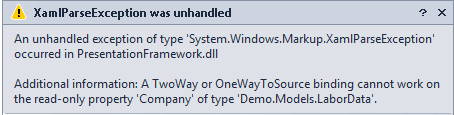

# Proxied Binding Provider for WPF

Summary
-

WPF binding is a great thing, typically.  But there is a particular scenario that it doesn't support.  It will not
allow you, out of the box, to do two way binding to readonly properties (private setters).  I know that the first 
reaction is, "yeah, well, that's why the properties are readonly.   You aren't supposed to change them directly!"

I would typically agree, although I was recently tasked with creating a utility for a client that required editing 
data that had been serialized to a database in JSON format.  Because of the rules engine in the service that was 
saving the data, they couldn't make the changes via their normal pipeline.   Editing the JSON directly is way too 
risky.  So the best bet was to deserialize the data in an external utility and update the values there.   

This sounded like a great idea until I discovered that in a lot of their classes, the properties were read only.  
When you attempt a two-way binding to a read-only property, this is what WPF gives you back:

 


Not very pretty.  And there is no mechanism for overriding the binding logic that I have discovered while looking at
the disassembled Microsoft code.   Luckily, WPF is a remarkably flexible language.  After turning my brain into a 
pretzle and covering it with horseradish mustard, I was able to work out a way to proxy the binding in such a way that 
I could use reflection to set the changed value on the source object.  Thus, the Proxied Binding Provider (BindingProxy).

What is it?
-

The Proxied Binding Provider is a class that provides for three attached properties that work together to allow 
for the binding of a FrameworkElement property to a source property in two-way mode, even if the source property
is read only.  

### Attached Properties
* Source
  * This property represents the data source object for the binding.   This should be bound to the object that
    directly owns the property.  (eg. if your datasource would be ```Store.Inventory.LastInventoryDate``` 
    then you would set this property to ```Store.Inventory```).
* SourceProperty
  * This property represents the name of the property on the source object that you wish to update when the target
    changes.  Unless you have a very unique situation, this will likely be a static string (e.g. "LastInventoryDate"
    using our example above)
* TargetProperty
  * This property represents the property of the target ```FrameworkElement``` object that you are binding to.  
    This should be an actual binding and will typically involve a ```RelativeSource={RelativeSource Self}```

#### Example

```
	<TextBox
		Text="{Binding Company, Mode=OneWay}"
		attachedProperties:BindingProxy.TargetProperty="{Binding Text, RelativeSource={RelativeSource Self}}"
		attachedProperties:BindingProxy.Source="{Binding}"
		attachedProperties:BindingProxy.SourceProperty="Company" />
```

You'll note that in the example above, we are still using native binding to the Text property.  This is important
because we use that to get additional binding information such as converters for our trip back to the source.   Also
we are not receiving updates from the source at all using our extension.  Thus, that becomes the job of the native
binding to update the control.   

In this example, we are binding the Text property of the Textbox to the Company property of our source (an object 
of type Demo.Models.LaborData).  Because the Company property of the LaborData class is readonly, we have to set the
native property to ```Mode=OneWay```.   Our BindingProxy is attached to the Text property as well.  When the value
of that property changes, we catch that, run it through the ConvertBack method of any included converter and then
set the SourceProperty via reflection.  For more details, review the code below.

```
private static void OnTargetPropertyChanged(DependencyObject target, DependencyPropertyChangedEventArgs e)
{
    var initialized = GetBindingProxyInitialized(target);
    if (!initialized)
    {
        //Don't run the first time through because binding flow has not yet been established
        SetBindingProxyInitialized(target, true);
        return;
    }

    //Get the target element
    var frameworkElement = target as FrameworkElement;
    if (frameworkElement == null) return;

    //Get the TargetProperty type descriptor
    var dependencyPropertyDescriptor = DependencyPropertyDescriptor.FromName(TargetPropertyProperty.Name, typeof(BindingProxy), target.GetType());
    if (dependencyPropertyDescriptor == null) return;

    //Get the binding expression for the target property
    var dependencyProperty = dependencyPropertyDescriptor.DependencyProperty;
    var bindingExpression = frameworkElement.GetBindingExpression(dependencyProperty);

    if (bindingExpression?.ResolvedSource == null || bindingExpression.ResolvedSourcePropertyName == null) return;

    //Get the source and source property bindings
    var source = GetSource(target);
    var sourceProperty = GetSourceProperty(target);

    if (source == null || sourceProperty == null) return;

    //Get the property info for the source property
    var propertyInfo = source.GetType().GetProperty(sourceProperty);
    if (propertyInfo == null) return;

    //Get the currently bound value from the target property
    var targetValue = frameworkElement.GetValue(bindingExpression.TargetProperty);
    var typedVal = targetValue;

    //If there is a converter, execute ConvertBack
    var converter = bindingExpression.ParentBinding.Converter;
    if (converter != null) typedVal = converter.ConvertBack(typedVal, propertyInfo.PropertyType, null, null);

    //Set the value via reflection on the Source object
    propertyInfo.SetValue(source, typedVal);
}
```

**Note:**  While I have not yet tried it, it is possible to use this same proxied property as a way of double binding.   
For example, if you wanted to capture any changes in the Text property and send it not just to the source object, but also
to a rules engine, logger, or validation routine; this could be an approach to use.

I hope this code proves useful to you.  Enjoy!
